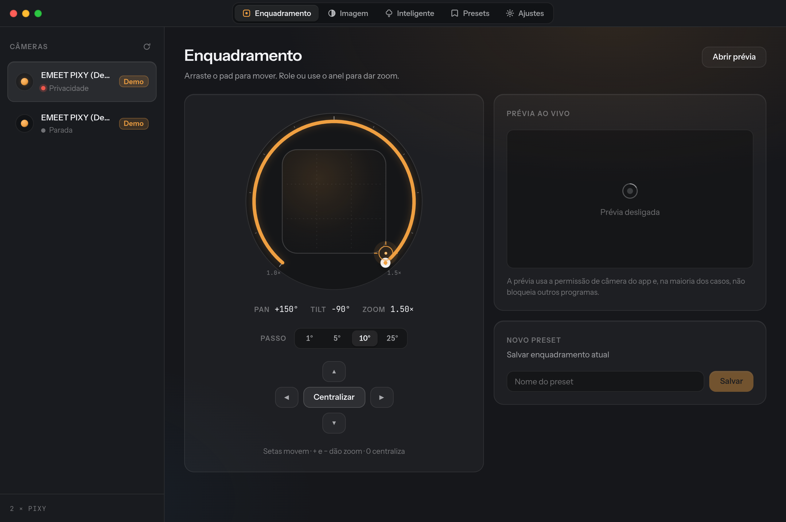

# openemeet

A native Linux control center for **EMEET PIXY** webcams, built with Electron.

The official EMEET software has no Linux build. openemeet talks to the camera
directly through two channels:

- **UVC / V4L2** — pan, tilt, zoom, exposure, white balance, focus, anti-flicker.
- **The PIXY HID control channel** — AI tracking, privacy mode, gesture control,
  audio profiles and auto-privacy. This is the proprietary part that generic
  webcam tools cannot reach.

Multiple PIXY cameras are supported at once, each with its own presets.



---

## Features

| Area | What you get |
|---|---|
| **Framing** | Optical PTZ pad with a zoom ring, hold-to-repeat jog buttons, keyboard framing, live preview |
| **Image** | Every control the camera actually exposes, discovered at runtime — never a hardcoded list |
| **Smart** | AI tracking · privacy mode · gesture control · audio profile (NC / Live / Original) · auto-privacy timeout · anti-flicker |
| **Presets** | Saved framings, scoped per camera by serial number |
| **Multi-camera** | Cameras paired to their HID node via USB topology, so two PIXYs never cross wires |
| **Tray** | GNOME AppIndicator menu: privacy, tracking, gestures, audio and presets without opening the window |
| **Bilingual** | Português (pt-BR) and English, following your system locale on first run |
| **Themes** | Dark, light, or follow the system |

---

## Install

### AppImage (recommended)

```bash
chmod +x openemeet-0.1.0-x86_64.AppImage
./openemeet-0.1.0-x86_64.AppImage
```

### Required: udev rule

The smart features need access to the camera's `hidraw` node. Without this rule
the app still runs, but the **Smart** tab stays unavailable and tells you so.

```bash
sudo tee /etc/udev/rules.d/99-openemeet-pixy.rules > /dev/null <<'EOF'
SUBSYSTEM=="hidraw", ATTRS{idVendor}=="328f", ATTRS{idProduct}=="00c0", MODE="0660", GROUP="video", TAG+="uaccess"
SUBSYSTEM=="video4linux", ATTRS{idVendor}=="328f", ATTRS{idProduct}=="00c0", MODE="0660", GROUP="video", TAG+="uaccess"
EOF
sudo udevadm control --reload-rules && sudo udevadm trigger
```

Then **unplug and reconnect the camera**.

**Settings → System integration** checks all of this for you and hands you the
exact command to copy when something is missing.

### Other requirements

- `v4l-utils` (provides `v4l2-ctl`) — `sudo pacman -S v4l-utils` / `sudo apt install v4l-utils`
- Membership of the `video` group: `sudo usermod -aG video "$USER"` (log out and back in)

### Tray icon on GNOME

GNOME has no built-in tray. Install and enable
**AppIndicator and KStatusNotifierItem Support** for the tray menu to appear.
openemeet detects whether it is present and says so in Settings; without it the
app simply behaves as a normal window (closing it quits, rather than hiding).

---

## No camera to hand?

**Settings → Devices → Demo mode** spins up two simulated PIXY cameras with the
full control set, so the entire interface is usable without hardware.

---

## Development

```bash
npm install
npm run dev        # hot-reloading Electron
npm run typecheck  # main + renderer
npm run build      # bundles into out/
npm run dist       # AppImage into dist/
```

### Layout

```
src/
  main/            Electron main process
    devices/       scanner · v4l2 · hidraw · controller · mock · manager
    store/         settings and per-camera presets (atomic JSON)
    system/        udev, group and GNOME tray diagnostics
    tray.ts        AppIndicator menu
  preload/         typed contextBridge surface
  renderer/        React UI
  shared/          types, HID protocol, i18n — used by both sides
```

---

## Protocol notes

The PIXY answers 32-byte HID reports on its `hidraw` node
(`328f:00c0`). A setting is written as a *set* report followed ~200 ms later by
a *commit* report:

| Feature | Set report | Commit |
|---|---|---|
| Tracking / privacy | `09 01 01 00 00 01 00 01 <mode>` | `09 01 01 01` |
| Gesture control | `09 04 02 00 00 02 00 02 02 <mode>` | `09 04 02 01 00 01 00 01 02` |
| Audio profile | `09 05 00 03 00 01 00 01 <mode>` | — |
| Auto-privacy | `09 02 01 00 00 04 00 04 <seconds>` | `09 02 01 01` |

Audio is the only state the camera reports back (`09 05 00 04`, mode in byte 8).
Tracking, gesture and auto-privacy are write-only, so openemeet caches them per
camera and restores the cache on startup.

Pan and tilt are in arc-seconds (degrees × 3600): pan ±540000, tilt ±324000,
zoom 100–150.

---

## Credits

The HID protocol was derived from the
[Emeet_pixy_for_linux](https://github.com/) reference implementation.

## License

MIT
